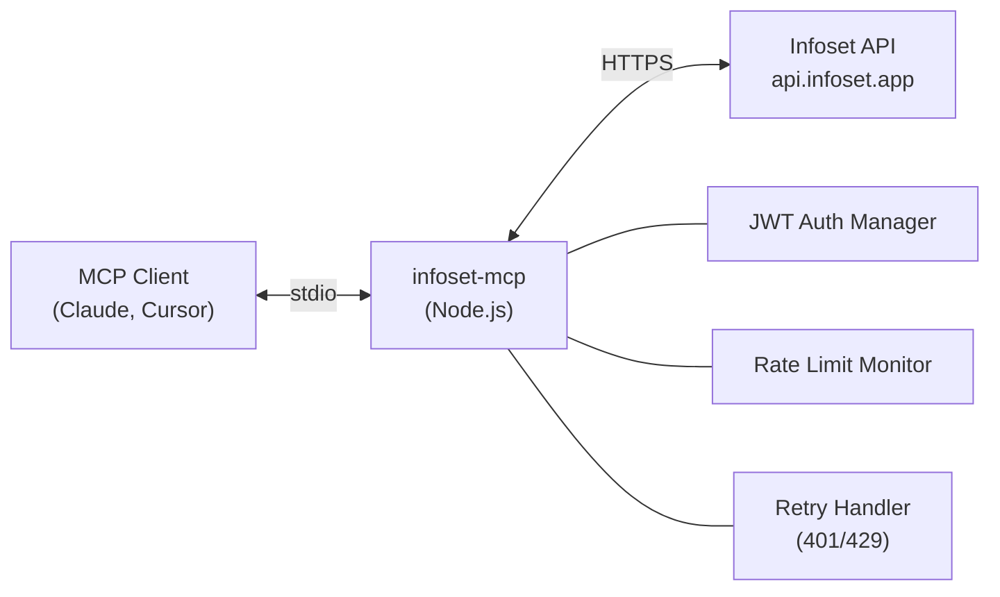

<div align="center">

# Infoset MCP Server

**Connect AI assistants to [Infoset](https://infoset.app) CRM via the Model Context Protocol.**

[](https://github.com/sudohakan/infoset-mcp/actions/workflows/ci.yml)
[](https://github.com/sudohakan/infoset-mcp/actions/workflows/release.yml)
[](https://github.com/sudohakan/infoset-mcp/releases)
[](https://opensource.org/licenses/MIT)
[](https://nodejs.org/)
[](https://modelcontextprotocol.io/)

<br>

**12 tools** &bull; **JWT auto-refresh** &bull; **Rate limit protection** &bull; **4 dependencies** &bull; **54 tests**

[Quick Start](#quick-start) &bull; [Tools](#tools) &bull; [Architecture](#architecture) &bull; [Examples](#usage-examples) &bull; [Development](#development)

</div>

---

## What is Infoset?

[Infoset](https://infoset.app) is an omnichannel customer service and CRM platform used by thousands of businesses for helpdesk ticketing, live chat, email management, and customer relationship tracking. This MCP server gives AI assistants direct access to Infoset's ticket management, contact lookup, and analytics capabilities.

## Features

- **12 production-ready tools** covering the full helpdesk ticket lifecycle
- **JWT authentication** with automatic token refresh on expiry &mdash; no mid-session interruptions
- **Smart rate limiting** &mdash; monitors `x-ratelimit-remaining` headers and pauses before hitting limits
- **Retry logic** &mdash; automatic retry with backoff for 401 (token refresh) and 429 (rate limit) responses
- **Zero configuration beyond credentials** &mdash; works out of the box with sensible defaults
- **Lightweight** &mdash; single file server with only 4 dependencies

---

## Quick Start

### Prerequisites

- **Node.js** >= 18.0.0
- An **Infoset account** with API access

### Installation

```bash
git clone https://github.com/sudohakan/infoset-mcp.git
cd infoset-mcp
npm install
```

### Configuration

The server requires three environment variables:

| Variable | Required | Description |
|----------|:--------:|-------------|
| `INFOSET_EMAIL` | Yes | Your Infoset login email |
| `INFOSET_PASSWORD` | Yes | Your Infoset login password |
| `INFOSET_BASE_URL` | No | API base URL (default: `https://api.infoset.app`) |

<details>
<summary><strong>Option A &mdash; MCP Client Configuration (Recommended)</strong></summary>

Add to your `.claude.json` (or equivalent MCP client config):

```json
{
  "mcpServers": {
    "infoset": {
      "command": "node",
      "args": ["/absolute/path/to/infoset-mcp/src/mcp-server.mjs"],
      "env": {
        "INFOSET_EMAIL": "your-email@example.com",
        "INFOSET_PASSWORD": "your-password",
        "INFOSET_BASE_URL": "https://api.infoset.app"
      }
    }
  }
}
```

</details>

<details>
<summary><strong>Option B &mdash; Environment File (Standalone)</strong></summary>

```bash
cp .env.example .env
# Edit .env with your credentials
npm start
```

</details>

---

## Tools

<details open>
<summary><h3>Ticket Operations (7 tools)</h3></summary>

| Tool | Description | Key Parameters |
|------|-------------|----------------|
| `infoset_list_tickets` | List tickets with filters and pagination | `status[]`, `ownerIds`, `page`, `itemsPerPage`, `fromUpdatedDate`, `sortCol`, `sortDir` |
| `infoset_get_ticket` | Get full ticket detail by ID | `ticketId` |
| `infoset_search_tickets` | Search tickets by keyword with filters | `query`, `status[]`, `priority`, `page`, `itemsPerPage` |
| `infoset_create_ticket` | Create a new ticket | `subject`, `contactId`, `priority`, `status`, `content` |
| `infoset_update_ticket` | Update ticket fields | `ticketId`, `status`, `priority`, `ownerIds[]`, `subject` |
| `infoset_get_ticket_logs` | Get activity log for a ticket | `ticketId`, `itemsPerPage`, `sortDir` |
| `infoset_get_ticket_stats` | Get ticket count breakdown by status | `ownerIds`, `fromDate`, `toDate` |

</details>

<details open>
<summary><h3>Contact & Company (3 tools)</h3></summary>

| Tool | Description | Key Parameters |
|------|-------------|----------------|
| `infoset_get_contact` | Get contact details by ID | `contactId` |
| `infoset_list_contacts` | List or search contacts | `query`, `page`, `itemsPerPage` |
| `infoset_get_company` | Get company details by ID | `companyId` |

</details>

<details open>
<summary><h3>Communication & SLA (2 tools)</h3></summary>

| Tool | Description | Key Parameters |
|------|-------------|----------------|
| `infoset_get_email` | Get email thread content | `emailId` |
| `infoset_get_sla_breaches` | Get SLA breach data for a ticket | `ticketId` |

</details>

### Reference Codes

| | 1 | 2 | 3 | 4 |
|---|---|---|---|---|
| **Status** | Open | Pending | Resolved | Closed |
| **Priority** | Low | Normal | High | Urgent |

---

## Usage Examples

<details>
<summary><strong>List open and pending tickets</strong></summary>

```json
infoset_list_tickets { "status": [1, 2], "itemsPerPage": 50 }
```

</details>

<details>
<summary><strong>Get ticket detail</strong></summary>

```json
infoset_get_ticket { "ticketId": 8837516 }
```

</details>

<details>
<summary><strong>Search tickets</strong></summary>

```json
infoset_search_tickets { "query": "payment error" }
```

</details>

<details>
<summary><strong>Create a ticket</strong></summary>

```json
infoset_create_ticket { "subject": "Login issue", "contactId": 12345, "priority": 3 }
```

</details>

<details>
<summary><strong>Update ticket status to resolved</strong></summary>

```json
infoset_update_ticket { "ticketId": 8837516, "status": 3 }
```

</details>

<details>
<summary><strong>Check SLA breaches</strong></summary>

```json
infoset_get_sla_breaches { "ticketId": 8837516 }
```

</details>

<details>
<summary><strong>Get ticket statistics</strong></summary>

```json
infoset_get_ticket_stats {}
```

</details>

---

## Architecture



The server runs as a stdio-based MCP process. The MCP client spawns it, sends tool call requests over stdin, and receives JSON responses over stdout. All diagnostic logging goes to stderr.

<details>
<summary><strong>Authentication Flow</strong></summary>

1. On startup, the server authenticates with Infoset using email/password credentials
2. A JWT token is obtained and cached in memory
3. Before each API request, the token expiry is checked &mdash; if within 60 seconds of expiry, a fresh token is obtained automatically
4. On 401 responses, the token is invalidated and re-obtained transparently (up to 3 retries)

</details>

<details>
<summary><strong>Rate Limiting</strong></summary>

The server monitors `x-ratelimit-remaining` response headers from the Infoset API. When the remaining request quota drops below 2, the server pauses for 60 seconds before continuing. On 429 (Too Many Requests) responses, the server retries up to 3 times with 60-second backoff intervals.

</details>

<details>
<summary><strong>Error Handling</strong></summary>

All API errors are caught and re-thrown with descriptive messages that include the HTTP method, endpoint path, status code, and response body. Network errors (timeouts, DNS failures) are propagated with the original error message. The MCP client receives these as tool call errors and can present them to the user or retry.

</details>

---

## Scope

This server covers the Infoset **helpdesk and CRM** domain: tickets, contacts, companies, email threads, SLA tracking, and ticket analytics.

The Infoset platform also offers chat, call center, deals, automation, and reporting APIs that are outside the current scope. Feature requests for additional tool coverage are welcome via [GitHub Issues](https://github.com/sudohakan/infoset-mcp/issues).

---

## Development

```bash
npm test          # Run test suite (54 tests)
npm start         # Start server in standalone mode
```

<details>
<summary><strong>Test Coverage</strong></summary>

The test suite covers:

- All 12 tool registrations and their schemas
- Happy path for every tool handler
- Error handling (404, 400, 500, network errors)
- Rate limit retry logic (429 backoff and exhaustion)
- Token refresh logic (401 re-authentication)

</details>

<details>
<summary><strong>Releasing</strong></summary>

This project uses [Semantic Versioning](https://semver.org/). To create a new release:

1. Update `version` in `package.json` and the `McpServer` constructor in `src/mcp-server.mjs`
2. Add release notes to `CHANGELOG.md`
3. Commit, tag, and push:

```bash
git tag -a vX.Y.Z -m "vX.Y.Z"
git push origin vX.Y.Z
```

The GitHub Actions release workflow automatically creates a GitHub Release with notes extracted from the changelog.

</details>

---

## Contributing

See [CONTRIBUTING.md](CONTRIBUTING.md) for development setup, code style, and pull request guidelines.

## Security

See [SECURITY.md](SECURITY.md) for credential handling best practices and vulnerability reporting.

---

<div align="center">

[MIT](LICENSE)

Built with [Claude Code](https://docs.anthropic.com/en/docs/claude-code)

</div>
